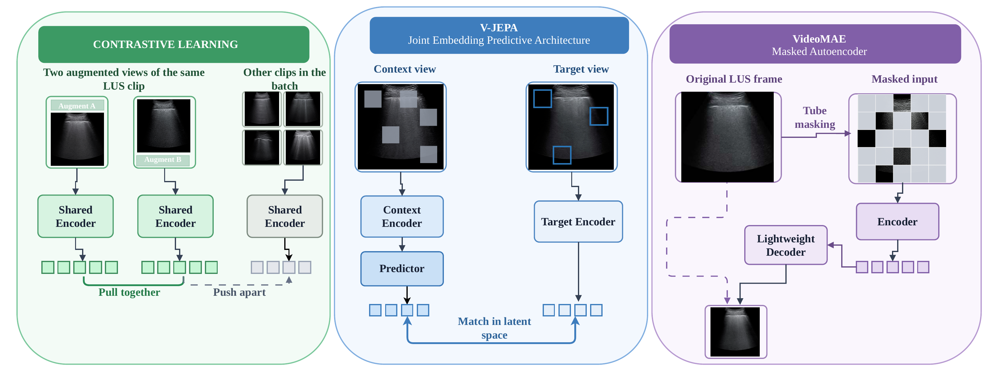
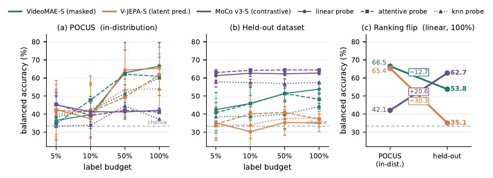

<div align="center">

# Which Pretext Task Transfers?

### Self-Supervised Pretraining Objectives for Lung Ultrasound

[Moein Heidari](mailto:moein.heidari@ubc.ca)<sup>1</sup> &nbsp;·&nbsp;
Junbo Rao<sup>1</sup> &nbsp;·&nbsp;
Jai Choraria<sup>1</sup> &nbsp;·&nbsp;
Wenjin Chen<sup>2</sup> &nbsp;·&nbsp;
David J. Foran<sup>2</sup> &nbsp;·&nbsp;
Ilker Hacihaliloglu<sup>1</sup>

<sup>1</sup> University of British Columbia &nbsp;&nbsp; <sup>2</sup> Rutgers Cancer Institute of New Jersey

[](https://arxiv.org/abs/2609.16551)
[](LICENSE)
[](#getting-started)
[](#getting-started)

</div>

---

> **TL;DR** — Contrastive, masked, and latent-prediction pretraining are compared on lung ultrasound video under a *single* fixed backbone, corpus, schedule, and frozen-probe protocol. The ranking on the in-distribution benchmark **reverses** on an independently acquired dataset, so in-distribution probe accuracy alone does not identify the objective that transfers.

## Overview

Self-supervised learning reduces the need for labelled medical images, but the choice of pretext objective remains unclear for lung ultrasound (LUS). Contrastive learning, masked reconstruction, and joint-embedding predictive architectures differ in **the space in which their targets are defined** — yet existing ultrasound studies compare them under different corpora, backbones, and evaluation protocols.

We remove those confounds. All three objectives share a ViT-S/16 backbone, the COVID-BLUeS pretraining corpus, one optimisation schedule, and one frozen-evaluation protocol, so measured differences can be attributed to the pretext task itself.

<div align="center">
  
  <p><em>The three pretext objectives applied to the same LUS clip. They differ in where the loss lives:<br/>contrastive compares whole-clip embeddings, latent prediction compares feature tokens, masked reconstruction compares pixels.</em></p>
</div>

## Key Finding

<div align="center">
  
</div>

Balanced accuracy at the **full label budget under linear probing**:

| Pretraining | Objective | POCUS (in-dist.) | Mendeley-Uganda (external) | Δ |
|:---|:---|:---:|:---:|:---:|
| **VideoMAE-S** | masked reconstruction | **66.5** <sub>±13.1</sub> | 53.8 <sub>±2.8</sub> | −12.7 |
| **V-JEPA-S** | latent prediction | 65.4 <sub>±11.7</sub> | 35.1 <sub>±4.9</sub> | −30.3 |
| **MoCo v3-S** | contrastive | 42.1 <sub>±1.2</sub> | **62.7** <sub>±1.0</sub> | **+20.6** |

The ranking flips from `VideoMAE ≈ V-JEPA > MoCo` on POCUS to `MoCo > VideoMAE > V-JEPA` on Mendeley-Uganda. V-JEPA is strong in-distribution and falls to near chance (33.3%) externally; MoCo does the opposite.

<details>
<summary><b>Full results — three probes × four label budgets</b></summary>

<br/>

Balanced accuracy (%), mean <sub>±std</sub> over five patient-level folds. Best per column in bold.

| Pretraining | Probe | POCUS 5% | 10% | 50% | 100% | Uganda 5% | 10% | 50% | 100% |
|:---|:---|:---:|:---:|:---:|:---:|:---:|:---:|:---:|:---:|
| **MoCo v3-S** | linear | 45.1 <sub>4.5</sub> | 41.3 <sub>1.8</sub> | 41.2 <sub>3.2</sub> | 42.1 <sub>1.2</sub> | 61.3 <sub>2.6</sub> | 62.6 <sub>1.8</sub> | 62.3 <sub>1.1</sub> | 62.7 <sub>1.0</sub> |
| | *k*NN | 33.3 <sub>0.0</sub> | 33.9 <sub>12.4</sub> | 44.6 <sub>7.2</sub> | 37.2 <sub>0.0</sub> | 57.9 <sub>2.8</sub> | 57.5 <sub>1.8</sub> | 57.0 <sub>2.5</sub> | 57.6 <sub>0.0</sub> |
| | attentive | **45.6** <sub>6.8</sub> | 39.2 <sub>3.5</sub> | 42.1 <sub>1.3</sub> | 41.1 <sub>0.9</sub> | **63.0** <sub>1.6</sub> | **64.2** <sub>0.9</sub> | **64.4** <sub>0.4</sub> | **64.4** <sub>0.2</sub> |
| **VideoMAE-S** | linear | 36.5 <sub>17.2</sub> | 39.7 <sub>7.6</sub> | 62.9 <sub>12.5</sub> | **66.5** <sub>13.1</sub> | 42.5 <sub>6.3</sub> | 45.9 <sub>9.1</sub> | 51.4 <sub>4.1</sub> | 53.8 <sub>2.8</sub> |
| | *k*NN | 38.6 <sub>12.7</sub> | 42.1 <sub>7.7</sub> | 51.3 <sub>4.9</sub> | 60.1 <sub>6.4</sub> | 38.6 <sub>7.8</sub> | 38.7 <sub>5.4</sub> | 39.9 <sub>8.0</sub> | 44.2 <sub>1.6</sub> |
| | attentive | 34.7 <sub>15.7</sub> | **47.8** <sub>8.8</sub> | 62.1 <sub>17.6</sub> | 60.9 <sub>10.6</sub> | 40.8 <sub>11.2</sub> | 45.8 <sub>9.0</sub> | 51.4 <sub>4.6</sub> | 48.2 <sub>3.6</sub> |
| **V-JEPA-S** | linear | 42.5 <sub>13.8</sub> | 37.5 <sub>23.6</sub> | **64.4** <sub>11.1</sub> | 65.4 <sub>11.7</sub> | 35.2 <sub>9.1</sub> | 30.3 <sub>10.8</sub> | 35.4 <sub>7.0</sub> | 35.1 <sub>4.9</sub> |
| | *k*NN | 39.9 <sub>12.6</sub> | 42.5 <sub>15.0</sub> | 53.6 <sub>10.9</sub> | 54.0 <sub>13.5</sub> | 33.7 <sub>6.8</sub> | 34.1 <sub>7.5</sub> | 37.7 <sub>6.4</sub> | 37.7 <sub>2.3</sub> |
| | attentive | 42.1 <sub>16.4</sub> | 41.3 <sub>14.5</sub> | 49.4 <sub>10.1</sub> | 61.8 <sub>11.5</sub> | 34.5 <sub>9.0</sub> | 40.1 <sub>10.2</sub> | 40.9 <sub>6.4</sub> | 37.3 <sub>4.3</sub> |

</details>

## Protocol

| | |
|:---|:---|
| **Backbone** | ViT-S/16, tubelet size 2, 16-frame clips, random init (no ImageNet weights) |
| **Pretraining** | [COVID-BLUeS](https://doi.org/10.1109/JBHI.2025.3543686) LUS videos — shared optimiser, LR schedule, and 100-epoch budget |
| **In-distribution eval** | [POCUS](https://github.com/jannisborn/covid19_ultrasound), 3-class (COVID-19 / bacterial pneumonia / healthy), patient-level 5-fold CV |
| **External eval** | Mendeley-Uganda (Katumba et al., *Data in Brief* 2025) — excluded from both pretraining and probe fitting |
| **Probes** | Linear, *k*NN, attentive — on **frozen** encoders, at 5% / 10% / 50% / 100% label budgets |
| **Metric** | Balanced accuracy, mean ± std over five folds |

Patient-level partitioning is essential: temporally adjacent LUS frames are near-duplicates, and frame-level splits inflate measured performance.

## Repository Structure

```
LUSVideoSSL/
├── pretraining/
│   ├── MoCo-v3/            # contrastive (InfoNCE, ViT-S/16 + tubelet embed)
│   ├── VideoMAE/          # masked reconstruction (tube masking, ρ = 0.9)
│   └── V-JEPA/            # latent prediction (EMA target encoder + predictor)
└── evaluation/
    └── lus_eval/          # manifests, frozen feature extraction, probes
```

## Getting Started

<details>
<summary><b>1 · Installation</b></summary>

<br/>

```bash
git clone https://github.com/moeinheidari7829/LUSVideoSSL.git
cd LUSVideoSSL

conda create -n lusssl python=3.9 -y && conda activate lusssl
pip install torch torchvision timm decord pandas numpy pillow scikit-learn
```

Pretraining backbones have their own requirements — see [`pretraining/VideoMAE/INSTALL.md`](pretraining/VideoMAE/INSTALL.md) and [`pretraining/V-JEPA/requirements.txt`](pretraining/V-JEPA/requirements.txt).

</details>

<details>
<summary><b>2 · Pretraining on COVID-BLUeS</b></summary>

<br/>

**VideoMAE-S** — 90% tube masking, 16 frames, stride 2:

```bash
cd pretraining/VideoMAE
python run_mae_pretraining.py \
  --data_path $SPLIT_FILE \
  --model pretrain_videomae_small_patch16_224 \
  --mask_type tube --mask_ratio 0.9 --decoder_depth 4 \
  --num_frames 16 --sampling_rate 2 \
  --batch_size 32 --epochs 100 --warmup_epochs 10 \
  --lr 1.5e-4 --weight_decay 0.05 --opt adamw --opt_betas 0.9 0.95 \
  --seed 0 --output_dir $OUTPUT_DIR
```

**V-JEPA-S** — config-driven:

```bash
cd pretraining/V-JEPA
python -m app.main --fname configs/custom/vits16_covid_100e_seed0.yaml --devices cuda:0
```

**MoCo v3-S** — contrastive, video-adapted (ViT-S/16 + tubelet patch embed):

```bash
cd pretraining/MoCo-v3
python main_moco_video.py \
  --manifest $MANIFEST \
  --clip-len 16 --tubelet-size 2 \
  --batch-size 4 --epochs 100 --lr 1.5e-4 \
  --checkpoint-dir ./outputs/checkpoints
```

SLURM launchers are provided for all three ([`train_videomae_100e.slurm`](pretraining/VideoMAE/train_videomae_100e.slurm), [`vjepa_small_100e_seed0.slurm`](pretraining/V-JEPA/vjepa_small_100e_seed0.slurm), [`train_mocov3_100e.slurm`](pretraining/MoCo-v3/train_mocov3_100e.slurm)).

</details>

<details>
<summary><b>3 · Building evaluation manifests</b></summary>

<br/>

```bash
cd evaluation/lus_eval

python build_pocus_manifest.py    --data-root $POCUS_ROOT    --output pocus.csv
python build_mendeley_manifest.py --data-root $MENDELEY_ROOT --output mendeley.csv
```

`build_pocus_manifest.py` produces the patient-level 5-fold assignment used throughout the paper.

</details>

<details>
<summary><b>4 · Frozen feature extraction</b></summary>

<br/>

```bash
export VJEPA_REPO=/path/to/LUSVideoSSL/pretraining/V-JEPA
export MOCOV3_REPO=/path/to/LUSVideoSSL/pretraining/MoCo-v3

python extract_vjepa_features.py \
  --manifest pocus.csv --checkpoint $VJEPA_CKPT --output features/vjepa_pocus.npz

python extract_videomae_features.py \
  --manifest pocus.csv --checkpoint $VIDEOMAE_CKPT --output features/videomae_pocus.npz

python extract_moco_features.py \
  --manifest pocus.csv --checkpoint $MOCOV3_CKPT --output features/moco_pocus.npz
```

Clips are deterministic 16-frame centre crops (stride 2, short side 256 → 224 centre crop, ImageNet normalisation). Each `.npz` holds pooled `[N, 384]` and temporal `[N, 8, 384]` features plus manifest metadata. Add `--limit 1` for a smoke test.

</details>

<details>
<summary><b>5 · Running the probes</b></summary>

<br/>

```bash
python run_probes.py --feature-root features/ --output-dir results/ --epochs 200 --seed 0
```

Writes `all_folds.csv`, `summary.csv`, and the sampled `label_selections.json` for every probe × label-budget combination.

</details>


## Acknowledgements

Supported by the Canada Foundation for Innovation John R. Evans Leaders Fund (CFI-JELF #42816), the Mitacs Accelerate program (AWD024298-IT33280), and NSERC (RGPIN-2023-03575).

This repository builds on [VideoMAE](https://github.com/MCG-NJU/VideoMAE), [V-JEPA](https://github.com/facebookresearch/jepa), and [MoCo v3](https://github.com/facebookresearch/moco-v3). We thank the authors of COVID-BLUeS, [POCUS](https://github.com/jannisborn/covid19_ultrasound), and the Mendeley-Uganda dataset for making their data public.

## License

Released under the [MIT License](LICENSE). Note that the upstream VideoMAE and V-JEPA codebases carry their own licenses.

<div align="center">
<br/>
<sub>Questions? Open an issue or reach out to <a href="mailto:moein.heidari@ubc.ca">moein.heidari@ubc.ca</a></sub>
</div>
